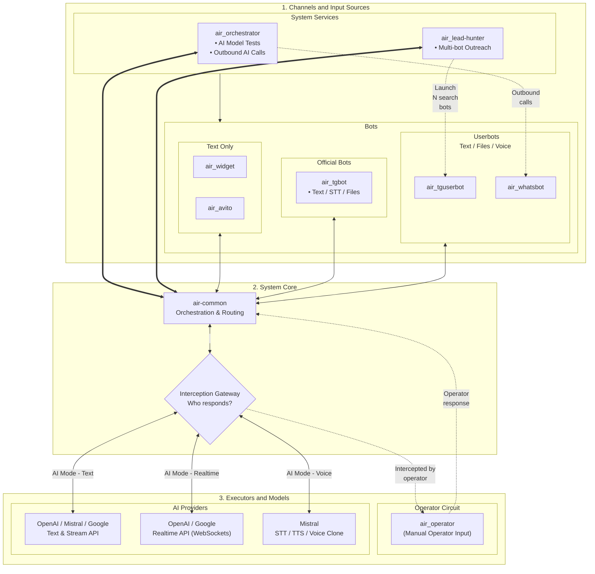

# air-common


[🇷🇺 Russian version](README.ru.md)

> air-common is a foundational Go library that provides the core infrastructure and centralized architecture for all production AI microservices within the marusia_ai project family (including air_orchestrator, air_whatsbot, and others).


[](https://t.me/marusia_dev)

## Features

### 🔌 Transparent Provider Abstraction
- Unified interface hiding provider-specific model interaction mechanisms.
- Supports different provider architectures, including Mistral Agents & Conversations and request-based APIs from OpenAI and Google.
- Provider-specific details such as context management, conversation state, tool execution, and streaming are handled inside the library.
- Downstream services use the same contracts and invocation flow regardless of the selected AI provider.
- Shared Go interfaces eliminate provider-specific boilerplate from higher application layers.

### 👥 Native Multi-User Architecture
- Full multi-user operation across models, dialogs, sessions, documents, API keys, and realtime connections.
- Strict user-scoped data separation through `userID` across routing, provider clients, storage, tools, and session management.
- Concurrent processing of independent users and their sessions.
- Per-user API-key resolution and provider access.
- User-specific encryption through Master Key integration.

### 💬 Text, Files, and Multimodal Requests
- Streaming text responses through provider-specific streaming APIs.
- Function calling and multi-turn tool execution.
- File upload, download, deletion, and provider file management.
- Audio transcription and voice-message processing.
- Support for text documents, metadata, embeddings, and vector similarity search.

### 🎙️ Realtime and Voice
- Native WebSocket event streaming for interactive, low-latency realtime sessions.
- Unified realtime session lifecycle across supported providers.
- Streaming audio, text, transcription, interruption, and usage events.
- Native Mistral Realtime API integration.
- Full support for Mistral's realtime voice cloning feature

### 🧑‍💼 Human Operator Handoff
- Operator mode for transferring conversations from AI to a human operator.
- Synchronous and asynchronous operator communication.
- Operator sessions with messaging channels, SSE connections, and idle timeouts.
- Seamless return from operator mode to AI processing.
- User- and dialog-scoped operator session management.

### 🔐 Security and Inter-Service Infrastructure
- Application-level encryption for API keys, OAuth credentials, documents, and protected user data.
- RPC/gRPC contracts for inter-service configuration and user Master Key retrieval.

### 🏗️ System Architecture



## Installation

Add the library to the service's Go module:

```bash
go get github.com/ikermy/air-common
```

## Usage

Basic model router initialization:

```go
package main

import (
	"context"

	"github.com/ikermy/air-common/pkg/model"
)

func main() {
	// Minimal functionality
	ctx, cancel := context.WithCancel(parent)
	router := model.NewModelRouter(ctx, nil)
	
	// Full functionality
	d, err := db.New(ctx)
	e := endpoint.New(ctx, d)
	router := model.NewModelRouter(ctx, d,
		model.WithDialogSaver(e),
		openai.NewAsRouterOption(),
		mistral.NewAsRouterOption(),
		google.NewAsRouterOption())
}
```

Specific AI providers are connected through router options and the corresponding `pkg/model/openai`, `pkg/model/mistral`, and `pkg/model/google` packages.

Examples of practical usage:

[](https://github.com/ikermy/air_orchestrator)
[](https://github.com/ikermy/air_tgbot)
[](https://github.com/ikermy/air_tguserbot)
[](https://github.com/ikermy/air_whatsbot)
[](https://github.com/ikermy/air_widget)
[](https://github.com/ikermy/air_avito)
[](https://github.com/ikermy/air_orchestrator)

## Architecture

The library provides shared contracts and infrastructure components for `air_` services:

```text
air_ service
    |
    +--> model.Router
    |       |
    |       +--> OpenAI
    |       +--> Mistral
    |       +--> Google
    |
    +--> startpoint / channels / realtime events
    +--> endpoint / comdb
    +--> rpc / google_services / crypto
```

`air-common` is not a standalone end-user application. Microservices use its packages and provide their own dependencies: a database, action handlers, key providers, and dialog persistence components.

## Main packages

| Package | Purpose                                            |
| --- |----------------------------------------------------|
| `pkg/mode` | Parameters for configuring library                 |
| `pkg/model` | Shared models, interfaces, router, and AI sessions |
| `pkg/model/openai` | OpenAI integration                                 |
| `pkg/model/mistral` | Mistral integration and voice workflows            |
| `pkg/model/google` | Google AI integration                              |
| `pkg/startpoint` | Session startup and lifecycle management           |
| `pkg/endpoint` | Dialogs, notifications, and external endpoints     |
| `pkg/comdb` | Storage contracts and operations                   |
| `pkg/rpc` | RPC/gRPC client and protobuf contracts             |
| `pkg/crypto` | Encryption and key handling                        |
| `pkg/google_services` | Google Calendar and Google Sheets                  |

## Configuration

The library does not define one mandatory set of environment variables: configuration is passed by the calling microservice through its dependencies and settings.

Depending on the connected components, the following may be required:

- OpenAI, Mistral, or Google API keys;
- database connection parameters;
- Google service OAuth settings;
- MCP server settings;
- a Master Key Provider for decrypting protected API keys.

Environment variable names and configuration format are defined by the specific `air_` service.

## Related services

- [air-common](https://github.com/ikermy/air-common) — shared library for AI microservices
- [air_orchestrator](https://github.com/ikermy/air_orchestrator) — main orchestration service
- [air_tgbot](https://github.com/ikermy/air_tgbot) — Telegram bot operating in polling/webhook mode with delta streaming
- [air_tguserbot](https://github.com/ikermy/air_tguserbot) — Telegram user bot that can receive and make voice calls
- [air_whatsbot](https://github.com/ikermy/air_whatsbot) — WhatsApp user bot without Graph API that can receive and make voice calls
- [air_widget](https://github.com/ikermy/air_widget) — chat widget for integration into any website
- [air_avito](https://github.com/ikermy/air_avito) — bot for replying in Avito chats
- [air_operator](https://github.com/ikermy/air_operator) — service for forwarding responses to and from an operator; AI works with all bot types
- [air_lead-hunter](https://github.com/ikermy/air_lead-hunter) — service for bots to find leads in Telegram and WhatsApp, including outgoing voice calls
- [air_payment](https://github.com/ikermy/air_payment) — service for receiving cryptocurrency payments from users through Bybit
- [marusia_crm](https://github.com/ikermy/marusia_crm) — service for integrating with external CRM systems
- [air-logger](https://github.com/ikermy/air-logger) — auxiliary event-logging service with multi-user support and Loki log collector support

## License

The project is distributed under the [MIT License](LICENSE). It permits freely using, copying, modifying, and distributing the software provided that the license text and copyright notice are retained.

The full license text is available in the [`LICENSE`](LICENSE) file.

## Contacts

[](https://t.me/ikermy)
