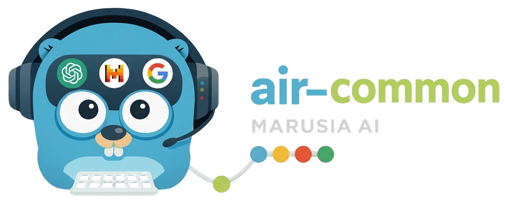
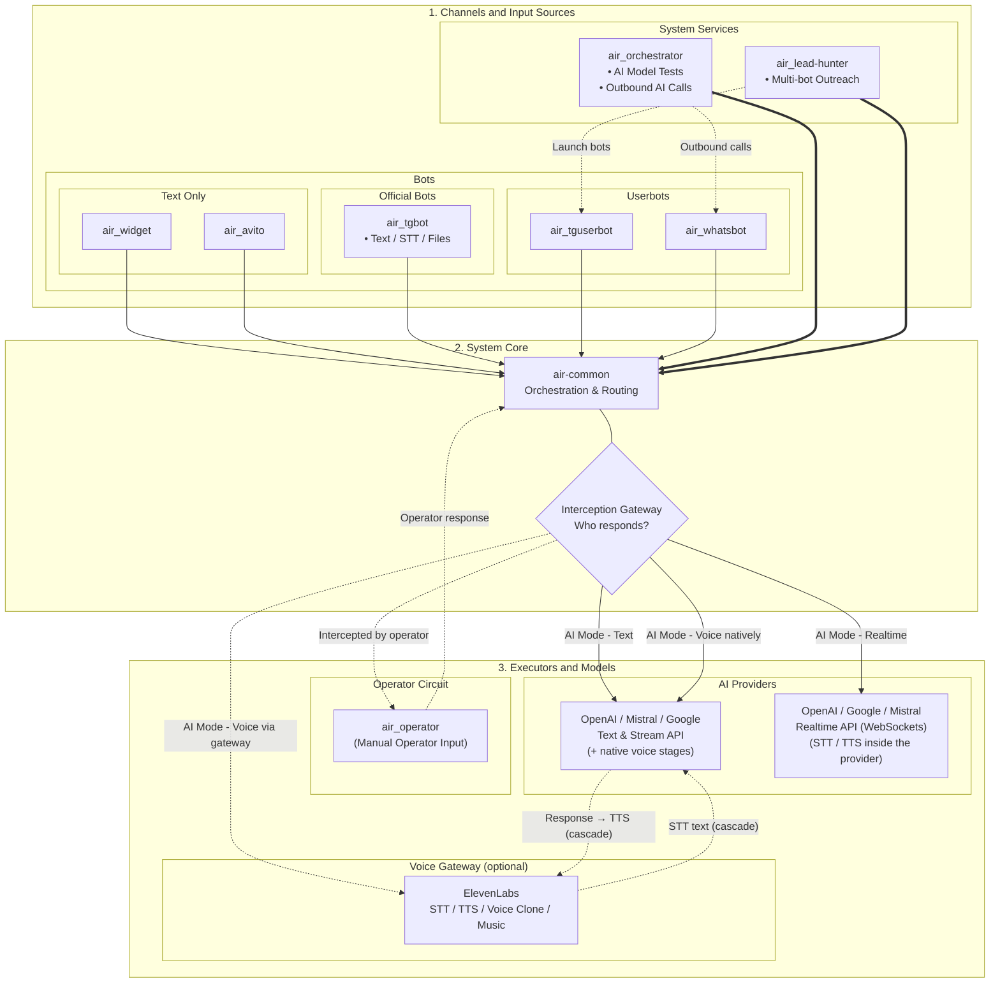

# air-common



[🇷🇺 Russian version](README.ru.md)

> air-common is a foundational Go library that provides the core infrastructure and centralized architecture for all production AI microservices within the marusia_ai project family (including air_orchestrator, air_whatsbot, and others).


[](https://t.me/marusia_dev)

## Features

### 🔌 Transparent Provider Abstraction

- Unified interface hiding provider-specific model interaction mechanisms.
- Supports different provider architectures, including Mistral Agents & Conversations and request-based APIs from OpenAI and Google.
- A separate class of **voice-only** providers (ElevenLabs) that do not provide an LLM and connect at the voice-gateway level on top of any dialog model.
- Provider-specific details such as context management, conversation state, tool execution, and streaming are handled inside the library.
- Downstream services use the same contracts and invocation flow regardless of the selected AI provider.
- Shared Go interfaces eliminate provider-specific boilerplate from higher application layers.

### 👥 Native Multi-User Architecture

- Full multi-user operation across models, dialogs, sessions, documents, API keys, and realtime connections.
- Strict user-scoped data separation through `userID` across routing, provider clients, storage, tools, and session management.
- Concurrent processing of independent users and their sessions.
- Per-user API-key resolution and provider access.
- User-specific encryption through Master Key integration.

### 💬 Text, Files, and Multimodal Requests

- Streaming text responses through provider-specific streaming APIs.
- Function calling and multi-turn tool execution.
- File upload, download, deletion, and provider file management.
- Audio transcription and voice-message processing.
- Support for text documents, metadata, embeddings, and vector similarity search.

### 🎙️ Realtime and Voice

- Native WebSocket event streaming for interactive, low-latency realtime sessions.
- Unified realtime session lifecycle across supported providers.
- Streaming audio, text, transcription, interruption, and usage events.
- Native Mistral Realtime API integration.
- Full support for Mistral's realtime voice cloning feature.
- Unified voice gateway (`Router.TranscribeAudio`, `SynthesizeSpeech`, `GenerateMusic`) with per-stage backend selection.
- Voice **cascade** STT → LLM → TTS, allowing ElevenLabs on top of any active LLM provider.

### 🗣️ ElevenLabs (voice-only provider)

ElevenLabs is connected as a **voice-only voice gateway without its own LLM**: it does not replace the OpenAI/Mistral/Google dialog model and is not another LLM provider in the common row — it sits as an intermediate layer in front of them for the voice stages. The user's active model remains the LLM provider, the voice backends are configured in `UniversalModelData.Voice` (`VoiceConfig`), and the LLM stage of the realtime cascade is delegated by the gateway to the active provider.

**Capabilities** (`ProviderType.Capabilities`): `tts`, `stt`, `voice_clone`, `music`, `speech_to_speech`.

**Backend selection** — in `UniversalModelData.Voice`:

- `tts_backend`, `stt_backend`, `realtime_backend`, `music_backend` — `elevenlabs` (as a string) or `4` (as a number);
- `voice_id` / `voice_name` — the selected voice;
- `tts` / `stt` / `music` / `sts` — stage models and parameters;
- `stt.model` — batch model (`scribe_v2`/`scribe_v1`), `stt.realtime_model` — realtime STT model (`scribe_v2_realtime`).

If a stage backend is not `elevenlabs`, the active LLM provider is used (previous behavior). Voice stages can also be served directly by the active provider (for example, Mistral Realtime with built-in STT/TTS), so ElevenLabs is an **optional** gateway, not a mandatory link.

**Text-message mode:**

- batch STT (`Router.TranscribeAudio`): with `voice.stt_backend = elevenlabs`, recognition goes through ElevenLabs Scribe; on error — fallback to the active provider.
- batch TTS (`Router.SynthesizeSpeech` / `SynthesizeSpeechStream`) — synthesis with the selected voice.

**Realtime mode (calls):**

- with `voice.realtime_backend = elevenlabs`, `Router.GetRealtimeProvider` returns the cascade `RealtimeProvider` (`pkg/model/realtime_cascade.go`);
- cascade: **ElevenLabs Scribe Realtime STT (WebSocket)** → **active provider LLM** → **ElevenLabs Streaming TTS**; the active provider's native audio-to-audio is not used in this mode;
- accounting/usage — the same as in a native realtime session: the same events (`input_transcript_done`, `response_text_delta/done`, `interrupted`, etc.);
- audio queue, barge-in, turn-guard, and drain are implemented in the cascade;
- LLM text deltas are normalized (`cascadeTextExtractor`), so provider JSON envelopes (`{"message": ...}` and service events) never reach TTS or events.

**Voice cloning:**

- `IVC (instant)` — the voice is ready immediately after uploading a sample;
- `PVC (professional)` — asynchronous training with progress (`fine_tuning_state`/`fine_tuning_progress`); available after voice verification on the ElevenLabs side;
- generic CRUD via the router: `ListVoices`, `GetVoice`, `CreateVoice`, `UpdateVoice`, `DeleteVoice`, `GetVoiceSample`.

**Music generation:** `Router.GenerateMusic` (`model_id`: `music_v2_5 | music_v2 | music_v1`), synchronous (`200` + audio) and asynchronous (`202` + polling) responses; enabled by the `CreateMusic` flag in the model data.

**Infrastructure:**

- the voice model catalog is stored in the `voice_models` table (`kind`: `tts|stt|music|sts`) and synced from the ElevenLabs `/v1/models` with an in-memory throttle;
- the ElevenLabs API key is stored per-user in `user_api_keys` (`provider = 'elevenlabs'`);
- the low-level client is the leaf package `pkg/elevenlabs` (TTS/STT/realtime STT/voices/music) with no dependency on `pkg/model`.

### 🧑‍💼 Human Operator Handoff

- Operator mode for transferring conversations from AI to a human operator.
- Synchronous and asynchronous operator communication.
- Operator sessions with messaging channels, SSE connections, and idle timeouts.
- Seamless return from operator mode to AI processing.
- User- and dialog-scoped operator session management.

### 🔐 Security and Inter-Service Infrastructure

- Application-level encryption for API keys, OAuth credentials, documents, and protected user data.
- RPC/gRPC contracts for inter-service configuration and user Master Key retrieval.

### 🏗️ System Architecture


```mermaid
graph TB
    %% --- 1. CHANNELS AND INPUT SOURCES ---
    subgraph L1_Channels ["1. Channels and Input Sources"]
        direction TB

        subgraph Group_Tools ["System Services"]
            direction TB
            ORCH["air_orchestrator<br/>• AI Model Tests<br/>• Outbound AI Calls"]
            LH["air_lead-hunter<br/>• Multi-bot Outreach"]
        end

        subgraph Group_AllBots ["Bots"]
            direction LR

            subgraph Group_Userbots ["Userbots"]
                direction TB
                TU["air_tguserbot"]
                WAB["air_whatsbot"]
            end

            subgraph Group_Bot ["Official Bots"]
                direction TB
                TGB["air_tgbot<br/>• Text / STT / Files"]
            end

            subgraph Group_Text ["Text Only"]
                direction TB
                WD["air_widget"]
                AV["air_avito"]
            end
        end
    end

    %% --- 2. SYSTEM CORE ---
    subgraph L2_Core ["2. System Core"]
        direction LR
        AC["air-common<br/>Orchestration & Routing"]
        OP_LOGIC{"Interception Gateway<br/>Who responds?"}

        AC --- OP_LOGIC
    end

    %% --- 3. EXECUTORS AND MODELS ---
    subgraph L3_Executors ["3. Executors and Models"]
        direction LR

        subgraph L3_Human ["Operator Circuit"]
            OP_HUMAN["air_operator<br/>(Manual Operator Input)"]
        end

        subgraph L4_VoiceGateway ["Voice Gateway (optional)"]
            EL["ElevenLabs<br/>STT / TTS / Voice Clone / Music"]
        end

        subgraph L4_Providers ["AI Providers"]
            direction TB
            LLM["OpenAI / Mistral / Google<br/>Text & Stream API<br/>(+ native voice stages)"]
            RT["OpenAI / Google / Mistral<br/>Realtime API (WebSockets)<br/>(STT / TTS inside the provider)"]
        end
    end

    %% --- DATA FLOWS AND ROUTING ---
    WD --> AC
    AV --> AC
    TGB --> AC
    TU --> AC
    WAB --> AC
    ORCH ==> AC
    LH ==> AC

    OP_LOGIC -.->|Intercepted by operator| OP_HUMAN
    OP_HUMAN -.->|Operator response| AC

    OP_LOGIC -->|AI Mode - Text| LLM
    %% Voice/realtime is served by the provider directly, without ElevenLabs
    OP_LOGIC -->|AI Mode - Realtime| RT
    OP_LOGIC -->|AI Mode - Voice natively| LLM

    %% Optional: ElevenLabs as a voice gateway on top of an LLM provider (cascade)
    OP_LOGIC -.->|AI Mode - Voice via gateway| EL
    EL -.->|"STT text (cascade)"| LLM
    LLM -.->|"Response → TTS (cascade)"| EL

    LH -.->|Launch bots| TU
    ORCH -.->|Outbound calls| WAB
```

## Usage

Basic model router initialization:

```go
package main

import (
	"context"

	"github.com/ikermy/air-common/pkg/model"
)

func main() {
	// Minimal functionality
	ctx, cancel := context.WithCancel(parent)
	router := model.NewModelRouter(ctx, nil)
	
	// Full functionality
	d, err := db.New(ctx)
	e := endpoint.New(ctx, d)
	router := model.NewModelRouter(ctx, d,
		model.WithDialogSaver(e),
		openai.NewAsRouterOption(),
		mistral.NewAsRouterOption(),
		google.NewAsRouterOption())
}
```

Specific AI providers are connected through router options and the corresponding `pkg/model/openai`, `pkg/model/mistral`, and `pkg/model/google` packages.

ElevenLabs is a voice-only provider: it has no dedicated router option and no `pkg/model/*` package, and is enabled through the model's voice configuration (`UniversalModelData.Voice`) on top of any active LLM provider. The client is kept in the leaf package `pkg/elevenlabs`.

Examples of practical usage:

[](https://github.com/ikermy/air_orchestrator)
[](https://github.com/ikermy/air_tgbot)
[](https://github.com/ikermy/air_tguserbot)
[](https://github.com/ikermy/air_whatsbot)
[](https://github.com/ikermy/air_widget)
[](https://github.com/ikermy/air_avito)
[](https://github.com/ikermy/air_orchestrator)

## Architecture

The library provides shared contracts and infrastructure components for `air_` services:

```text
air_ service
    |
    +--> model.Router
    |       |
    |       +--> OpenAI
    |       +--> Mistral
    |       +--> Google
    |       +--> ElevenLabs (optional voice-gateway: STT / TTS / Clone / Music)
    |
    +--> startpoint / channels / realtime events
    +--> endpoint / comdb
    +--> rpc / google_services / crypto
```

`air-common` is not a standalone end-user application. Microservices use its packages and provide their own dependencies: a database, action handlers, key providers, and dialog persistence components.

## Main packages

| Package | Purpose |
| --- |---|
| `pkg/mode` | Parameters for configuring the library |
| `pkg/model` | Shared models, interfaces, router, and AI sessions |
| `pkg/model/openai` | OpenAI integration |
| `pkg/model/mistral` | Mistral integration and voice workflows |
| `pkg/model/google` | Google AI integration |
| `pkg/elevenlabs` | ElevenLabs voice client: TTS, STT, realtime STT, voices/cloning, music |
| `pkg/model/provider_catalog` | Provider model catalog synchronization |
| `pkg/startpoint` | Session startup and lifecycle management |
| `pkg/endpoint` | Dialogs, notifications, and external endpoints |
| `pkg/comdb` | Storage contracts and operations |
| `pkg/rpc` | RPC/gRPC client and protobuf contracts |
| `pkg/crypto` | Encryption and key handling |
| `pkg/google_services` | Google Calendar and Google Sheets |

## Configuration

The library does not define one mandatory set of environment variables: configuration is passed by the calling microservice through its dependencies and settings.

Depending on the connected components, the following may be required:

- OpenAI, Mistral, or Google API keys;
- an ElevenLabs API key (voice-only: stored per-user in `user_api_keys`, connected without a dedicated router option);
- database connection parameters;
- Google service OAuth settings;
- MCP server settings;
- a Master Key Provider for decrypting protected API keys.

Environment variable names and configuration format are defined by the specific `air_` service.

## Related services

- [air-common](https://github.com/ikermy/air-common) — shared library for AI microservices
- [air_orchestrator](https://github.com/ikermy/air_orchestrator) — main orchestration service
- [air_tgbot](https://github.com/ikermy/air_tgbot) — Telegram bot operating in polling/webhook mode with delta streaming
- [air_tguserbot](https://github.com/ikermy/air_tguserbot) — Telegram user bot that can receive and make voice calls
- [air_whatsbot](https://github.com/ikermy/air_whatsbot) — WhatsApp user bot without Graph API that can receive and make voice calls
- [air_widget](https://github.com/ikermy/air_widget) — chat widget for integration into any website
- [air_avito](https://github.com/ikermy/air_avito) — bot for replying in Avito chats
- [air_operator](https://github.com/ikermy/air_operator) — service for forwarding responses to and from an operator; AI works with all bot types
- [air_lead-hunter](https://github.com/ikermy/air_lead-hunter) — service for bots to find leads in Telegram and WhatsApp, including outgoing voice calls
- [air_payment](https://github.com/ikermy/air_payment) — service for receiving cryptocurrency payments from users through Bybit
- [marusia_crm](https://github.com/ikermy/marusia_crm) — service for integrating with external CRM systems
- [air-logger](https://github.com/ikermy/air-logger) — auxiliary event-logging service with multi-user support and Loki log collector support
- [air_front](https://github.com/ikermy/air_front) — Frontend react next.js dashboard for managing models, interaction channels, services...

## License

The project is distributed under the [MIT License](LICENSE). It permits freely using, copying, modifying, and distributing the software provided that the license text and copyright notice are retained.

The full license text is available in the [`LICENSE`](LICENSE) file.

## Contacts

[](https://t.me/ikermy)
