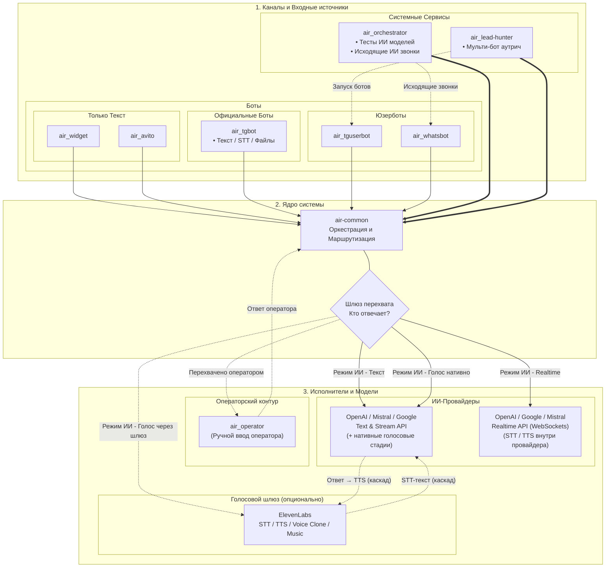

# air-common


[🇬🇧 Английская версия](README.md)

> air-common — это базовая библиотека на Go, обеспечивающая общую инфраструктуру и централизованную архитектуру для всех продакшн-микросервисов искусственного интеллекта в семействе проектов marusia_ai (включая air_orchestrator, air_whatsbot и другие).


[](https://t.me/marusia_dev)

## Функциональность

### 🔌 Прозрачная абстракция провайдеров

- Единый интерфейс, скрывающий специфичные для провайдеров механизмы взаимодействия с моделями.
- Поддержка различных архитектур провайдеров, включая Mistral Agents & Conversations и API на основе запросов от OpenAI и Google.
- Отдельный класс **voice-only**-провайдеров (ElevenLabs), которые не предоставляют LLM и подключаются на уровне голосового шлюза поверх любой диалоговой модели.
- Специфичные для провайдера детали, такие как управление контекстом, состояние диалога, выполнение инструментов и потоковая обработка, обрабатываются внутри библиотеки.
- Последующие сервисы используют одинаковые контракты и порядок вызовов независимо от выбранного AI-провайдера.
- Общие Go-интерфейсы устраняют необходимость в специфичном для провайдера шаблонном коде на верхних слоях приложения.

### 👥 Нативная многопользовательская архитектура

- Полноценная многопользовательская работа с моделями, диалогами, сессиями, документами, API-ключами и realtime-соединениями.
- Строгое разделение данных по пользователям через `userID` на уровнях маршрутизации, клиентов провайдеров, хранения, инструментов и управления сессиями.
- Параллельная обработка независимых пользователей и их сессий.
- Определение API-ключа и доступа к провайдеру для каждого пользователя.
- Шифрование пользовательских данных с использованием Master Key.

### 💬 Текстовые, файловые и мультимодальные запросы

- Потоковая передача текстовых ответов через специфичные для провайдеров streaming API.
- Function calling и многошаговое выполнение инструментов.
- Загрузка, скачивание и удаление файлов, а также управление файлами у провайдеров.
- Транскрибация аудио и обработка голосовых сообщений.
- Поддержка текстовых документов, метаданных, embeddings и поиска по векторному сходству.

### 🎙️ Realtime и голосовые функции

- Нативная потоковая передача событий через WebSocket для интерактивных realtime-сессий с низкой задержкой.
- Единый жизненный цикл realtime-сессий для поддерживаемых провайдеров.
- Потоковая передача аудио, текста, транскрипций, событий прерывания и информации об использовании токенов.
- Нативная интеграция с Mistral Realtime API.
- Полная поддержка realtime-функций клонирования голоса Mistral.
- Унифицированный голосовой шлюз (`Router.TranscribeAudio`, `SynthesizeSpeech`, `GenerateMusic`) с выбором backend'а на каждую стадию.
- Голосовой **каскад** STT → LLM → TTS, позволяющий использовать ElevenLabs поверх любого активного LLM-провайдера.

### 🗣️ ElevenLabs (voice-only провайдер)

ElevenLabs подключается как **voice-only голосовой шлюз (gateway) без собственной LLM**: он не заменяет диалоговую модель OpenAI/Mistral/Google и не является ещё одним LLM-провайдером в общем ряду, а встаёт промежуточным слоем перед ними на голосовых стадиях. Активной моделью пользователя остаётся LLM-провайдер, голосовые backend'ы задаются в `UniversalModelData.Voice` (`VoiceConfig`), а LLM-стадию realtime-каскада шлюз делегирует активному провайдеру.

**Возможности** (`ProviderType.Capabilities`): `tts`, `stt`, `voice_clone`, `music`, `speech_to_speech`.

**Выбор backend'ов** — в `UniversalModelData.Voice`:

- `tts_backend`, `stt_backend`, `realtime_backend`, `music_backend` — `elevenlabs` (строкой) или `4` (числом);
- `voice_id` / `voice_name` — выбранный голос;
- `tts` / `stt` / `music` / `sts` — модели и параметры стадий;
- `stt.model` — batch-модель (`scribe_v2`/`scribe_v1`), `stt.realtime_model` — модель realtime-STT (`scribe_v2_realtime`).

Если бэкенд стадии не равен `elevenlabs`, используется активный LLM-провайдер (прежнее поведение). Голосовые стадии могут обслуживаться и напрямую активным провайдером (например, Mistral Realtime со встроенными STT/TTS), поэтому ElevenLabs — **опциональный** шлюз, а не обязательное звено.

**Режим текстовых сообщений:**

- batch-STT (`Router.TranscribeAudio`): при `voice.stt_backend = elevenlabs` распознавание идёт в ElevenLabs Scribe; при ошибке — fallback на активного провайдера.
- batch-TTS (`Router.SynthesizeSpeech` / `SynthesizeSpeechStream`) — синтез выбранным голосом.

**Realtime-режим (звонки):**

- при `voice.realtime_backend = elevenlabs` `Router.GetRealtimeProvider` возвращает каскадный `RealtimeProvider` (`pkg/model/realtime_cascade.go`);
- каскад: **STT ElevenLabs Scribe Realtime (WebSocket)** → **LLM активного провайдера** → **TTS ElevenLabs Streaming**; нативный audio-to-audio активного провайдера в этом режиме не используется;
- начисление/учёт — как у нативной realtime-сессии: те же события (`input_transcript_done`, `response_text_delta/done`, `interrupted` и т.д.);
- очередь аудио, barge-in, turn-guard и drain реализованы в каскаде;
- текстовые дельты LLM нормализуются (`cascadeTextExtractor`), поэтому JSON-конверты провайдера (`{"message": ...}` и служебные события) не попадают в TTS и события.

**Клонирование голоса:**

- `IVC (instant)` — голос готов сразу после загрузки сэмпла;
- `PVC (professional)` — асинхронное обучение с прогрессом (`fine_tuning_state`/`fine_tuning_progress`); доступно после верификации голоса на стороне ElevenLabs;
- generic CRUD через маршрутизатор: `ListVoices`, `GetVoice`, `CreateVoice`, `UpdateVoice`, `DeleteVoice`, `GetVoiceSample`.

**Генерация музыки:** `Router.GenerateMusic` (`model_id`: `music_v2_5 | music_v2 | music_v1`), синхронный (`200` + аудио) и асинхронный (`202` + polling) ответы; включается флагом `CreateMusic` в данных модели.

**Инфраструктура:**

- каталог голосовых моделей хранится в таблице `voice_models` (`kind`: `tts|stt|music|sts`) и синхронизируется из `/v1/models` ElevenLabs с in-memory throttle;
- API-ключ ElevenLabs хранится per-user в `user_api_keys` (`provider = 'elevenlabs'`);
- низкоуровневый клиент — leaf-пакет `pkg/elevenlabs` (TTS/STT/realtime STT/voices/music) без зависимости от `pkg/model`.

### 🧑‍💼 Передача диалога оператору

- Режим оператора для передачи диалога от AI человеку-оператору.
- Синхронное и асинхронное взаимодействие с оператором.
- Операторские сессии с каналами сообщений, SSE-соединениями и тайм-аутами бездействия.
- Плавное возвращение из режима оператора к обработке AI.
- Управление операторскими сессиями в контексте пользователя и диалога.

### 🔐 Безопасность и межсервисная инфраструктура

- Шифрование на уровне приложения для API-ключей, OAuth-учётных данных, документов и защищённых пользовательских данных.
- RPC/gRPC-контракты для межсервисной конфигурации и получения пользовательского Master Key.

### 🏗️ Архитектура системы



## Использование

Базовая инициализация маршрутизатора моделей:

```go
package main

import (
	"context"

	"github.com/ikermy/air-common/pkg/model"
)

func main() {
	// Минимальная функциональность
	ctx, cancel := context.WithCancel(parent)
	router := model.NewModelRouter(ctx, nil)
	
	// Полная функциональность
	d, err := db.New(ctx)
	e := endpoint.New(ctx, d)
	router := model.NewModelRouter(ctx, d,
		model.WithDialogSaver(e),
		openai.NewAsRouterOption(),
		mistral.NewAsRouterOption(),
		google.NewAsRouterOption())
}
```

Конкретные AI-провайдеры подключаются через опции маршрутизатора и соответствующие пакеты `pkg/model/openai`, `pkg/model/mistral` и `pkg/model/google`.

ElevenLabs — voice-only-провайдер: отдельной router-опции и пакета `pkg/model/*` он не имеет, а включается через голосовую конфигурацию модели (`UniversalModelData.Voice`) поверх любого активного LLM-провайдера. Клиент вынесен в leaf-пакет `pkg/elevenlabs`.

Примеры практического использования:

[](https://github.com/ikermy/air_orchestrator)
[](https://github.com/ikermy/air_tgbot)
[](https://github.com/ikermy/air_tguserbot)
[](https://github.com/ikermy/air_whatsbot)
[](https://github.com/ikermy/air_widget)
[](https://github.com/ikermy/air_avito)
[](https://github.com/ikermy/air_orchestrator)

## Архитектура

Библиотека предоставляет общие контракты и инфраструктурные компоненты для сервисов `air_`:

```text
air_-сервис
    |
    +--> model.Router
    |       |
    |       +--> OpenAI
    |       +--> Mistral
    |       +--> Google
    |       +--> ElevenLabs (опциональный voice-gateway: STT / TTS / Clone / Music)
    |
    +--> startpoint / channels / realtime events
    +--> endpoint / comdb
    +--> rpc / google_services / crypto
```

`air-common` не является самостоятельным конечным приложением. Микросервисы используют её пакеты и передают собственные зависимости: базу данных, обработчики действий, провайдеры ключей и компоненты сохранения диалогов.

## Основные пакеты

| Пакет | Назначение |
| --- |---|
| `pkg/mode` | Параметры конфигурации библиотеки |
| `pkg/model` | Общие модели, интерфейсы, маршрутизатор и AI-сессии |
| `pkg/model/openai` | Интеграция с OpenAI |
| `pkg/model/mistral` | Интеграция с Mistral и голосовые сценарии |
| `pkg/model/google` | Интеграция с Google AI |
| `pkg/elevenlabs` | Голосовой клиент ElevenLabs: TTS, STT, realtime STT, голоса/клонирование, музыка |
| `pkg/model/provider_catalog` | Синхронизация каталогов моделей провайдеров |
| `pkg/startpoint` | Запуск сессий и управление их жизненным циклом |
| `pkg/endpoint` | Диалоги, уведомления и внешние endpoints |
| `pkg/comdb` | Контракты и операции хранения |
| `pkg/rpc` | RPC/gRPC-клиент и protobuf-контракты |
| `pkg/crypto` | Шифрование и работа с ключами |
| `pkg/google_services` | Google Calendar и Google Sheets |

## Конфигурация

Библиотека не задаёт единый обязательный набор переменных окружения: конфигурация передаётся вызывающим микросервисом через его зависимости и настройки.

В зависимости от подключённых компонентов могут потребоваться:

- API-ключи OpenAI, Mistral или Google;
- API-ключ ElevenLabs (voice-only: хранится per-user в `user_api_keys`, подключается без отдельной router-опции);
- параметры подключения к базе данных;
- OAuth-настройки Google-сервисов;
- настройки MCP-серверов;
- Master Key Provider для расшифровки защищённых API-ключей.

Названия переменных окружения и формат конфигурации определяются конкретным `air_`-сервисом.

## Связанные сервисы

- [air-common](https://github.com/ikermy/air-common) — общая библиотека для AI-микросервисов
- [air_orchestrator](https://github.com/ikermy/air_orchestrator) — основной сервис оркестрации
- [air_tgbot](https://github.com/ikermy/air_tgbot) — Telegram-бот, работающий в режиме polling/webhook, с потоковой передачей дельт
- [air_tguserbot](https://github.com/ikermy/air_tguserbot) — Telegram-бот пользователя, способный принимать и совершать голосовые звонки
- [air_whatsbot](https://github.com/ikermy/air_whatsbot) — пользовательский WhatsApp-бот без Graph API, способный принимать и совершать голосовые звонки
- [air_widget](https://github.com/ikermy/air_widget) — чат-виджет для интеграции с любым веб-сайтом
- [air_avito](https://github.com/ikermy/air_avito) — бот для ответов в чатах Avito
- [air_operator](https://github.com/ikermy/air_operator) — сервис передачи ответов оператору и от оператора; AI работает со всеми типами ботов
- [air_lead-hunter](https://github.com/ikermy/air_lead-hunter) — сервис для поиска ботами лидов в Telegram и WhatsApp, включая исходящие голосовые звонки
- [air_payment](https://github.com/ikermy/air_payment) — сервис приёма криптовалютных платежей от пользователей через Bybit
- [marusia_crm](https://github.com/ikermy/marusia_crm) — сервис интеграции с внешними CRM-системами
- [air-logger](https://github.com/ikermy/air-logger) — вспомогательный сервис журналирования событий с поддержкой многопользовательского режима и сборщика логов Loki
- [air_front](https://github.com/ikermy/air_front) — Frontend react next.js панель управления моделями, каналами взаимодействия, сервисами...

## Лицензия

Проект распространяется по [лицензии MIT](LICENSE). Она разрешает свободно использовать, копировать, изменять и распространять программное обеспечение при условии сохранения текста лицензии и уведомления об авторских правах.

Полный текст лицензии доступен в файле [`LICENSE`](LICENSE).

## Контакты

[](https://t.me/ikermy)
